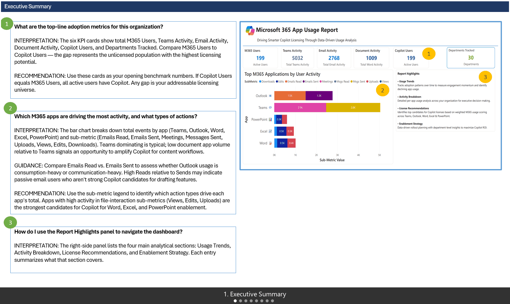
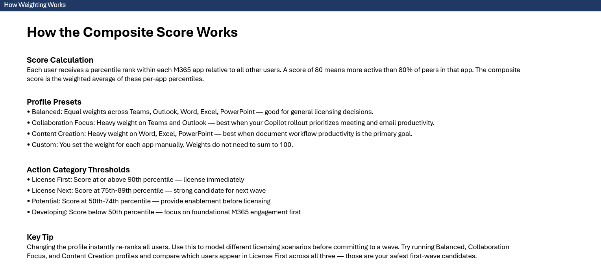

# M365 Usage Dashboard

<div align="center">

**User-level Microsoft 365 adoption and Copilot engagement reporting, powered by Purview audit logs.**

[](https://github.com/microsoft/Analytics-Hub)
[](https://github.com/microsoft/Analytics-Hub)

### 📥 [Click Here to Download All Files](https://github.com/microsoft/M365UsageAnalytics/archive/refs/heads/main.zip)

**Additional Resources:**
[Microsoft Purview Portal](https://purview.microsoft.com/) · [Microsoft Entra Admin Center](https://entra.microsoft.com/) · [PAX Purview Script](https://github.com/microsoft/PAX)

⭐ **Star this repository** to receive notifications about new template versions<br>
👀 **Watch** for updates and announcements

**[Prerequisites ↓](#-prerequisites)** &nbsp;·&nbsp; **[Required Roles & Permissions ↓](#-required-roles--permissions)** &nbsp;·&nbsp; **[Instructions ↓](#-instructions)** &nbsp;·&nbsp; **[Report Pages ↓](#-report-pages-overview)** &nbsp;·&nbsp; **[Troubleshooting ↓](#-troubleshooting)**

</div>

---

| | |
|---|---|
| **Data Source** | Microsoft Purview — Unified Audit Log |
| **Data Source** | Microsoft Entra ID — User Profiles |
| **Asset** | Power BI Template (`.pbit`) |
| **Output** | Two or more CSV files — Purview audit log export (processed through the included explosion script) and Entra user/licensing export (generated separately) |

---

<details>
<summary><strong>📊 What This Dashboard Shows</strong></summary>

<br>

Copilot licensing decisions shouldn't be made on gut feel or org chart. This report turns your existing M365 Unified Audit Log into a tiered, prioritized view of user readiness — so you deploy Copilot licenses to the users most likely to get value from day one.

**Executive Overview:**
How active is the tenant across M365 workloads? How many users are Copilot-licensed vs. unlicensed? Which apps are driving the most engagement?

**Copilot Enablement Strategy:**
Which users are highly active in M365 but underusing Copilot? Who are your Champions? Where are the biggest gaps between M365 engagement and Copilot adoption?

**Licensing Priority & Strategy:**
Which unlicensed users should be licensed first? How do Teams-heavy, Outlook-heavy, and Office-heavy users rank under different weighting profiles? What licensing wave should each user fall into?

**M365 Usage Activity & Trends:**
How are users distributed across engagement segments? Is engagement trending up or down week over week? Are Copilot-licensed users more active than unlicensed users?

| Report Page | What You Can Answer |
|---|---|
| **Executive Summary** | What is our overall M365 adoption rate? Which apps are driving the most engagement? |
| **M365 Usage Trends** | How is activity trending week over week? Which apps dominate the workload mix? |
| **Copilot License Recommendations** | Who should get a Copilot license first based on weighted M365 usage? |
| **Copilot Enablement Strategy** | Where are the biggest gaps between M365 usage and Copilot adoption? Who are Champions vs. Enablement Targets? |
| **Glossary & Definitions** | Definitions for all metrics, tiers, engagement segments, and scoring methodology in the dashboard. |
| **M365 Usage Activity** | How are users distributed across engagement segments? Are Copilot-licensed users more active? |
| **Enablement Strategy — Priority Table** | Which users need training most urgently? What is each user's recommended next action? |
| **Copilot Licensing Strategy** | Which users should be licensed in each wave? How do users rank across all M365 apps? |

</details>

---

<details>
<summary><strong>🖥️ Report Pages Overview</strong></summary>

<br>

The dashboard includes **8 interactive report pages**. The slideshow below cycles through each page automatically (3 seconds per slide). Click the image to view it full-size. See the [Interpretation Guide](M365%20Usage%20Dashboard%20-%20Interpretation%20Guide%20-%2009%20March%202026.pdf) for a detailed walkthrough of each page.

[](images/report-pages-carousel.gif)
*💡 Click the slideshow or any screenshot below to view it full-size.*

---

<details>
<summary><strong>1. Executive Summary</strong></summary>

Your landing page — six headline KPI cards (total M365 users, Teams activity, email activity, document activity, Copilot users, and departments tracked), a stacked bar chart breaking down total events by app and action type, and a Report Highlights panel linking to the dashboard's four main analytical sections.

[](images/1-Executive%20Summary.png)
*Click image to enlarge*

</details>

<details>
<summary><strong>2. M365 Usage Trends</strong></summary>

Headline KPIs for total users, active users, all-app actions, and average actions per user. A ranked bar chart shows which apps drive the most total activity, a donut chart highlights each app's proportional share, and a week-over-week trend line tracks average actions per app over time. A tier distribution matrix segments users into Top 10%, 10–25%, 25–50%, and Bottom 50% per application.

[](images/2-M365%20Usage%20Trends.png)
*Click image to enlarge*

</details>

<details>
<summary><strong>3. Copilot License Recommendations</strong></summary>

Every user ranked by a weighted composite score (0–100) blending their percentile across selected M365 apps. Choose from four profile presets — Balanced, Collaboration Focus, Content Creation, or Custom — to model different licensing scenarios. Users are classified into action categories: License First (≥90th percentile), License Next (75th–89th), Potential (50th–74th), and Developing (<50th). A Customize Weight panel lets you manually adjust per-app weights.

[](images/3-Copilot%20License%20Recommendations.png)
*Click image to enlarge*

</details>

<details>
<summary><strong>4. Copilot Enablement Strategy</strong></summary>

A 2×2 quadrant model classifying every user into four segments: **Enablement Targets** (high M365 / low Copilot — best training candidates), **Champions** (high on both — peer advocates), **AI-First** (low M365 / high Copilot), and **Low Engagement** (low on both). Filter by app to see workflow-specific quadrants, and sort by the Enablement Gap column to find users with the largest gap between M365 activity and Copilot adoption.

[](images/4-Copilot%20Enablement%20Strategy.png)
*Click image to enlarge*

</details>

<details>
<summary><strong>5. Glossary & Definitions</strong></summary>

In-report reference covering every metric, quadrant, tier label, engagement segment, and scoring methodology used across the dashboard. Includes definitions for active days, app tiers, composite scores, enablement gaps, and action categories so the report can be shared broadly without external documentation.

[](images/5-Glossary%20%26%20Definitions.png)
*Click image to enlarge*

</details>

<details>
<summary><strong>6. M365 Usage Activity</strong></summary>

Four KPI cards covering total users, M365 actions, average actions per week, and average active days. A bar chart ranks apps by average active days per user per week, and a segmentation chart groups users by engagement level — Daily (20+ days), Frequent (11–19), Moderate (6–10), Infrequent (1–5), and Inactive (0). A comparison chart shows whether Copilot-licensed users are more active than unlicensed users.

[](images/6-M365%20Usage%20Activity.png)
*Click image to enlarge*

</details>

<details>
<summary><strong>7. Copilot Enablement Strategy — Priority Table</strong></summary>

Each user assigned a Priority level (Critical, High, Medium, Promoter, Low) and a recommended Action (Immediate Training, Train Next, Advanced Training, Monitor) based on the ratio of M365 activity to Copilot usage. App Tier and Copilot Tier columns show each user's relative standing. Filter by app and priority level to generate targeted training outreach lists.

[](images/7-Copilot%20Enablement%20Strategy%20-%20Priority%20Table.png)
*Click image to enlarge*

</details>

<details>
<summary><strong>8. Copilot Licensing Strategy</strong></summary>

A tier-based licensing planner with four waves: **Prioritize** (top M365 users — license immediately), **License Next** (strong candidates for the next quarter), **Enablement** (moderate usage — train before licensing), and **Monitor** (low activity — revisit later). Color-coded cells show each user's tier in Teams, Outlook, Word, Excel, and PowerPoint. Filter by action tier to export ready-made licensing request lists.

[](images/8-Copilot%20Licensing%20Strategy.png)
*Click image to enlarge*

</details>

</details>

---

<details>
<summary><strong>⚖️ How Weighting Works</strong></summary>

<br>

The **Copilot License Recommendations** page uses a composite score to rank every user from 0–100. Understanding how the score is calculated helps you choose the right profile and interpret the results.

#### Score Calculation

Each user receives a percentile rank within each M365 app relative to all other users. A score of 80 means the user is more active than 80% of peers in that app. The composite score is the weighted average of these per-app percentiles.

#### Profile Presets

| Profile | Weighting Approach | Best For |
|---|---|---|
| **Balanced** | Equal weights across Teams, Outlook, Word, Excel, PowerPoint | General licensing decisions |
| **Collaboration Focus** | Heavy weight on Teams and Outlook | Copilot rollouts prioritizing meeting and email productivity |
| **Content Creation** | Heavy weight on Word, Excel, PowerPoint | Document workflow productivity goals |
| **Custom** | You set the weight for each app manually (weights do not need to sum to 100) | Organization-specific scenarios |

#### Action Category Thresholds

| Category | Percentile | Recommended Action |
|---|---|---|
| **License First** | ≥ 90th | License immediately — highest M365 engagement |
| **License Next** | 75th–89th | Strong candidate for next licensing wave |
| **Potential** | 50th–74th | Provide enablement before licensing |
| **Developing** | < 50th | Focus on foundational M365 engagement first |

> 💡 **Tip:** Changing the profile instantly re-ranks all users. Try running Balanced, Collaboration Focus, and Content Creation profiles and compare which users appear in License First across all three — those are your safest first-wave candidates.

[](images/How-Weighting-Works.png)
*Click image to enlarge*

</details>

---

<details>
<summary><strong>✅ Prerequisites</strong></summary>

Before you begin, make sure you have:

- [ ] **Power BI Desktop** installed (June 2024 or later recommended)
- [ ] Access to **Microsoft Purview** compliance portal — Audit search
- [ ] Access to **Microsoft Entra admin center** — to export user data
- [ ] Required roles assigned (see below)
- [ ] PowerShell 7+ installed (for data pull scripts)
- [ ] Python 3.9+ installed (for the Purview data explosion processor)

</details>

---

<details>
<summary><strong>🔑 Required Roles & Permissions</strong></summary>

Two data sources feed this dashboard. Requirements differ based on your export method.

### 1. Purview Audit Log Data

#### Manual Export (Purview Portal UI)

To search and export audit logs through the [Microsoft Purview compliance portal](https://purview.microsoft.com/), the user account needs **one** of the following roles:

| Role | Where Assigned | Notes |
|---|---|---|
| `View-Only Audit Logs` | Microsoft Purview compliance portal → Roles | Minimum required — read-only access to audit search and export |
| `Audit Logs` | Microsoft Purview compliance portal → Roles | Read and configure access to audit search |
| `Compliance Administrator` | Microsoft Entra ID → Roles | Includes audit log access |
| `Global Administrator` | Microsoft Entra ID → Roles | Full access — use only if other roles aren't available |

#### Script Export ([PAX](https://github.com/microsoft/PAX) / Microsoft Graph API)

The PAX script uses the [Microsoft Graph Security Audit Log Query API](https://learn.microsoft.com/en-us/graph/api/security-auditcoreroot-post-auditlogqueries) to retrieve audit data. The following **Microsoft Graph API permissions** are required:

| Permission | Purpose | Required? |
|---|---|---|
| `AuditLog.Read.All` | General audit log access | ✅ Yes |
| `ThreatIntelligence.Read.All` | GET operations — query status checks and result retrieval | ✅ Yes |
| `AuditLogsQuery-Entra.Read.All` | Entra ID (Azure AD) audit logs | ✅ Yes |
| `AuditLogsQuery-Exchange.Read.All` | Exchange Online audit logs | ✅ Yes |
| `AuditLogsQuery-OneDrive.Read.All` | OneDrive audit logs | ✅ Yes |
| `AuditLogsQuery-SharePoint.Read.All` | SharePoint Online audit logs | ✅ Yes |
| `Organization.Read.All` | Tenant and organization context, license metadata | ✅ Yes |
| `User.Read.All` | Entra user directory and M365 Copilot licensing (used with `-IncludeUserInfo`) | ✅ Yes |

These permissions apply to both **Delegated** (interactive sign-in) and **Application** (app registration) authentication modes.

> **Purview Audit Reader Role (Delegated Auth Only):** When running the PAX script with interactive authentication (WebLogin, DeviceCode, Credential), the user must also be assigned the **Purview Audit Reader** role so the Exchange audit backend recognizes them as authorized. This role is **not required** for application-only authentication (`-Auth AppRegistration`).

> **📚 Reference:** [Create auditLogQuery — Permissions](https://learn.microsoft.com/en-us/graph/api/security-auditcoreroot-post-auditlogqueries#permissions) · [Get auditLogQuery — Permissions](https://learn.microsoft.com/en-us/graph/api/security-auditlogquery-get#permissions) · [PAX Prerequisites](https://github.com/microsoft/PAX)

### 2. Entra ID User & Licensing Data

Both export methods (manual and script) require Microsoft Graph API permissions to retrieve user profiles and licensing information:

| Permission | Purpose | Required? |
|---|---|---|
| `User.Read.All` | Read all user profiles, department, job title, manager, account status | ✅ Yes |
| `Organization.Read.All` | Tenant context and license SKU metadata | ✅ Yes |

> **Note:** If you use the PAX script with `-IncludeUserInfo` or `-OnlyUserInfo`, these permissions are already included in the audit log permission set above — no additional configuration is needed.

### Audit Log Retention

Audit log data is not available instantly. Retention periods depend on your Microsoft 365 license tier:

| License | Default Retention | Maximum |
|---|---|---|
| Audit (Standard) — E3 / A3 | 180 days | 180 days |
| Audit (Premium) — E5 / A5 | 1 year (Exchange, SharePoint, OneDrive, Entra); 180 days (all other activities) | 1 year |
| Audit (Premium) — E5 / A5 + 10-Year Add-On | Same defaults as E5 | Up to 10 years (via custom retention policy) |

> **Note:** The default retention for Audit (Standard) changed from 90 days to 180 days on October 17, 2023. The 10-year maximum requires the **10-Year Audit Log Retention** add-on license in addition to E5.

Confirm your license tier before pulling data to understand how far back your audit logs are available.

</details>

---

<details>
<summary><strong>📋 Instructions</strong></summary>

<br>

### Step 1. Export Your M365 Unified Audit Log Data (Required)

You need a CSV export of your organization's Unified Audit Log containing M365 usage activity. There are two ways to get this data. The raw export from either method contains a nested JSON column (`AuditData`) that must be flattened before Power BI can use it — **Step 2** covers this processing step.

#### Method 1: Manual Export from Microsoft Purview

Go to the [Microsoft Purview Portal](https://purview.microsoft.com/) and export your Unified Audit Log as a CSV. You must search for the specific operation types this dashboard requires — the same set the [PAX script](https://github.com/microsoft/PAX) retrieves when run with `-IncludeM365Usage`.

<details>
<summary><strong>Detailed step-by-step guide</strong></summary>

<br>

### Quick Reference:

1. **Navigate to Audit Search**
   - Go to [https://purview.microsoft.com/](https://purview.microsoft.com/) (or [https://compliance.microsoft.com/](https://compliance.microsoft.com/))
   - In the left sidebar, select the **Audit** solution
   - Select the **Search** tab

2. **Configure Your Search**
   - **Date range**: Set based on your analysis needs
   - **Activities**: You must specify the operation types listed in the **Required Operation Types** table below. Do **not** leave this blank — pulling all activity types will return a massive volume of data that the dashboard does not use
   - **Record types**: If the Purview UI requires record type filters alongside operation filters, use the record types listed in the table below
   - **Users**: Leave blank to capture the full tenant, or scope to a specific group
   - Click **Search** and wait for the job to complete

3. **Export the Results**
   - Once the search status shows **Completed**, click on the job name
   - Click **Export results** → **Download all results**
   - The exported CSV contains the standard Purview audit log columns: `CreationDate`, `UserIds`, `Operations`, and `AuditData`
   - Do **not** pre-process or re-save the file — column order and formatting must be preserved

4. **Rename and Place the File**
   - Rename the exported file or note its exact file path
   - This raw CSV will be used as input to the explosion processor in **Step 2**

> ⚠️ **Important — Purview UI export row limits:**
>
> | License | Max Rows per Export |
> |---|---|
> | Audit (Standard) | 50,000 |
> | Audit (Premium) | 100,000 |
>
> These limits apply only to the Purview portal UI. In a large organization, a single day of activity can easily exceed these caps — meaning you would need to run many separate searches across smaller date ranges, export each one individually, and manually combine the CSV files before importing into Power BI. This quickly becomes impractical at scale.
>
> By contrast, the **PAX script** ([Method 2](#method-2-pax-purview-audit-log-processor-script-recommended)) uses the Microsoft Graph API and runs **multiple queries in parallel** behind the scenes. It automatically breaks your date range into smaller time slices, runs them simultaneously, and stitches the results together into a single CSV — capable of producing files with **tens of millions of records** or more. You never have to think about row limits, date ranges, or combining files.
>
> **If your tenant has more than a few hundred users, we strongly recommend skipping the manual UI approach and going straight to [Method 2 (PAX script)](#method-2-pax-purview-audit-log-processor-script-recommended).** It does all the heavy lifting for you, can be scheduled to run on its own, and scales to any size tenant.

---

### Required Operation Types

The following operation types are required by this dashboard. They match exactly what the [PAX script](https://github.com/microsoft/PAX) retrieves when run with the `-IncludeM365Usage` switch.

| Category | Operations |
|---|---|
| **Copilot** | CopilotInteraction |
| **Outlook / Exchange** | MailboxLogin, MailItemsAccessed, Send, SendOnBehalf, SoftDelete, HardDelete, MoveToDeletedItems, CopyToFolder |
| **SharePoint / OneDrive — Files** | FileAccessed, FileDownloaded, FileUploaded, FileModified, FileDeleted, FileMoved, FileCheckedIn, FileCheckedOut, FileRecycled, FileRestored, FileVersionsAllDeleted |
| **SharePoint / OneDrive — Sharing** | SharingSet, SharingInvitationCreated, SharingInvitationAccepted, SharedLinkCreated, SharingRevoked, AddedToSecureLink, RemovedFromSecureLink, SecureLinkUsed |
| **Groups** | AddMemberToUnifiedGroup, RemoveMemberFromUnifiedGroup |
| **Teams — Team / Channel** | TeamCreated, TeamDeleted, TeamArchived, TeamSettingChanged, TeamMemberAdded, TeamMemberRemoved, MemberAdded, MemberRemoved, MemberRoleChanged, ChannelAdded, ChannelDeleted, ChannelSettingChanged, ChannelOwnerResponded, ChannelMessageSent, ChannelMessageDeleted, BotAddedToTeam, BotRemovedFromTeam, TabAdded, TabRemoved, TabUpdated, ConnectorAdded, ConnectorRemoved, ConnectorUpdated |
| **Teams — Chat / Messaging** | TeamsSessionStarted, ChatCreated, ChatRetrieved, ChatUpdated, MessageSent, MessageRead, MessageDeleted, MessageUpdated, MessagesListed, MessageCreation, MessageCreatedHasLink, MessageEditedHasLink, MessageHostedContentRead, MessageHostedContentsListed, SensitiveContentShared |
| **Teams — Meetings** | MeetingCreated, MeetingUpdated, MeetingDeleted, MeetingStarted, MeetingEnded, MeetingParticipantJoined, MeetingParticipantLeft, MeetingParticipantRoleChanged, MeetingRecordingStarted, MeetingRecordingEnded, MeetingDetail, MeetingParticipantDetail, LiveNotesUpdate, AINotesUpdate, RecordingExported, TranscriptsExported |
| **Teams — Apps / Approvals** | AppInstalled, AppUpgraded, AppUninstalled, CreatedApproval, ApprovedRequest, RejectedApprovalRequest, CanceledApprovalRequest |
| **Word, Excel, PowerPoint, OneNote** | Create, Edit, Open, Save, Print |
| **Forms** | CreateForm, EditForm, DeleteForm, ViewForm, CreateResponse, SubmitResponse, ViewResponse, DeleteResponse |
| **Stream** | StreamModified, StreamViewed, StreamDeleted, StreamDownloaded |
| **Planner** | PlanCreated, PlanDeleted, PlanModified, TaskCreated, TaskDeleted, TaskModified, TaskAssigned, TaskCompleted |
| **PowerApps** | LaunchedApp, CreatedApp, EditedApp, DeletedApp, PublishedApp |

**Record types** (needed for API-level filtering): ExchangeAdmin, ExchangeItem, ExchangeMailbox, SharePointFileOperation, SharePointSharingOperation, SharePoint, OneDrive, MicrosoftTeams, OfficeNative, MicrosoftForms, MicrosoftStream, PlannerPlan, PlannerTask, PowerAppsApp

> 📖 **Source:** [PAX `-IncludeM365Usage` documentation](https://github.com/microsoft/PAX)

</details>

---

#### Method 2: PAX Purview Audit Log Processor Script (Recommended)

The [PAX Purview Audit Log Processor](https://github.com/microsoft/PAX) is an open-source Microsoft PowerShell script that automates Purview unified audit log retrieval via the Microsoft Graph API. It runs multiple queries in parallel — automatically breaking your date range into smaller time slices, sending them simultaneously, and combining the results into a single CSV file. It handles pagination, rate limiting, and retry logic automatically, and can produce output files with tens of millions of records. When run with the `-IncludeM365Usage` switch, it pulls all the operation types this dashboard needs.

> ⚠️ **Important:** Do **not** use PAX's built-in data explosion/flattening options. While PAX does offer optional explosion switches, the Python explosion processor included in this repository (Step 2) is **up to 50× faster** for large datasets. Pull the raw (unexploded) data with PAX, then run the Python script separately to flatten it.

**Why choose this over manual exports?**

- **Can run on a schedule** — Set it up once, then automate it to run daily, weekly, or monthly so your dashboard data stays current without any manual effort
- **Runs completely unattended** — No need to sit at the keyboard; the script handles everything on its own from start to finish
- **No practical record limits** — Manual Purview exports are capped at 50K–100K rows per export; the PAX script runs parallel queries and combines the results, routinely producing files with tens of millions of records for large tenants
- **Automatically resumes if interrupted** — If a data pull is paused or fails for any reason, the script picks up right where it left off with no lost progress
- **Pulls exactly the right data** — Targets only the audit log activity types this dashboard requires
  <br>*When run with the recommended settings shown in the step-by-step guide below. The raw CSV output still needs to be processed through the explosion script (Step 2) before importing into Power BI.*

<details>
<summary><strong>Detailed step-by-step guide</strong></summary>

<br>

1. **Download the script** from the [PAX GitHub repository](https://github.com/microsoft/PAX) — download the latest version of the `PAX_Purview_Audit_Log_Processor` script

2. **Run the script with the `-IncludeM365Usage` switch** to include all M365 usage activity types:

   **Interactive web login (easiest — no app registration required):**
   ```powershell
   .\PAX_Purview_Audit_Log_Processor.ps1 -IncludeM365Usage -StartDate "2025-01-01" -EndDate "2025-06-30"
   ```

   **App Registration (for scheduled / unattended runs):**
   ```powershell
   .\PAX_Purview_Audit_Log_Processor.ps1 -ClientId "<app-id>" -TenantId "<tenant-id>" -ClientSecret "<secret>" -IncludeM365Usage -StartDate "2025-01-01" -EndDate "2025-06-30"
   ```

3. **Locate the output** — The script outputs a CSV file to the current directory upon completion. The file path is displayed in the console output. This raw CSV will be used as input to the explosion processor in **Step 2**.

> 💡 **The PAX script can also export Entra user and licensing data** needed by this dashboard — either alongside the Purview audit data in a single run or on its own. See **Option B** in the [Export Entra User Details](#step-3-export-entra-user-details) section below for details.

> 📖 See the [PAX repository](https://github.com/microsoft/PAX) for full documentation, authentication setup guides, and advanced options.

</details>

---

### Step 2. Process the Purview Export (Explosion / Flattening)

The raw Purview CSV — whether exported manually from the Purview UI or pulled via the PAX script — contains a column called `AuditData` that stores each event's details as a nested JSON string. The Power BI template cannot import this raw format directly. Before loading the data into Power BI, you need to run the included Python script to “explode” (flatten) the `AuditData` JSON into individual columns that the template can read.

> 💡 **Why a separate script instead of PAX's built-in explosion?** The PAX script does include optional explosion/flattening switches, but the Python processor included in this repository is **up to 50× faster** for large datasets. We recommend pulling raw (unexploded) data from Purview and then running this Python script as a separate step.

<details>
<summary><strong>Detailed step-by-step guide</strong></summary>

<br>

The explosion processor is located in the [`scripts/`](scripts/) folder of this repository:

| File | Purpose |
|---|---|
| [`Purview_M365_Usage_Bundle_Explosion_Processor.py`](scripts/Purview_M365_Usage_Bundle_Explosion_Processor_v1.0.0.py) | Main explosion processor — flattens `AuditData` JSON into 153 individual columns |
| [`Purview_M365_Usage_Bundle_Explosion_Processor.ps1`](scripts/Purview_M365_Usage_Bundle_Explosion_Processor_v1.0.0.ps1) | PowerShell wrapper — auto-detects Python, installs [orjson](https://pypi.org/project/orjson/) for faster parsing, then launches the Python script |

#### Option A: Run the Python script directly

```bash
python scripts/Purview_M365_Usage_Bundle_Explosion_Processor.py --input "Purview_Export.csv"
```

The script outputs a new CSV file named `<input_stem>_Exploded.csv` in the same folder as the input file. You can also specify a custom output path:

```bash
python scripts/Purview_M365_Usage_Bundle_Explosion_Processor.py --input "Purview_Export.csv" --output "Exploded_Output.csv"
```

#### Option B: Use the PowerShell wrapper

If you prefer PowerShell, the wrapper script auto-detects your Python installation, ensures [orjson](https://pypi.org/project/orjson/) is installed for optimal performance, and launches the processor for you:

```powershell
## Exploded output file in same location as input file
.\scripts\Purview_M365_Usage_Bundle_Explosion_Processor.ps1 -input "Purview_Export.csv"

## Exploded output file with custom name and/or location
.\scripts\Purview_M365_Usage_Bundle_Explosion_Processor.ps1 -input "Purview_Export.csv" -output "Exploded_Output.csv"
```

#### What the script does

- Reads each row of the raw Purview CSV and parses the `AuditData` JSON column
- Flattens nested objects and arrays (including Copilot event data with messages, contexts, and accessed resources) into individual columns
- Produces a new CSV with 153 columns matching the schema the Power BI template expects
- Uses multiprocessing for fast parallel processing — handles files with millions of records efficiently

#### Optional parameters

| Parameter | Description |
|---|---|
| `-input` / `-i` | **(Required)** Path to the raw Purview CSV |
| `-output` / `-o` | Output file path (default: `<input>_Exploded.csv`) |
| `-prompt-filter` | Filter Copilot messages: `Prompt`, `Response`, `Both`, or `Null` |
| `-workers` | Number of parallel workers (default: auto-detected based on CPU cores) |
| `-quiet` / `-q` | Suppress progress output |

> 💡 **Performance tip:** The optional [orjson](https://pypi.org/project/orjson/) package provides 5–10× faster JSON parsing. The **PowerShell wrapper** (Option B) automatically detects and installs it for you. If you run the Python script directly (Option A), you can install it yourself with `pip install orjson`. The script works either way — it falls back to Python's built-in JSON parser if orjson is not available.

**Locate the output** — The exploded CSV file path is displayed in the console summary. Use this file path as the `PurviewData` parameter in Power BI Desktop (Step 4).

> ℹ️ **Only the Purview audit log export needs this step.** Entra user data (Step 3) can be imported into Power BI directly without any additional processing.

</details>

---

### Step 3. Export Entra User Details

The report joins audit log data to Entra ID user attributes (department, license status, etc.) for filtering and Copilot license analysis. Without this data, department-level breakdowns and license-based insights will not be available.

<details>
<summary><strong>Detailed step-by-step guide</strong></summary>

<br>

#### Option A: Export from Entra Admin Center (Manual)

1. **Navigate to Microsoft Entra Admin Center**
   - Go to [https://entra.microsoft.com/](https://entra.microsoft.com/)
   - In the left sidebar, go to **Users** → **All users**

2. **Export User List**
   - Click **Download users** (top toolbar)
   - Select **All users** and include at minimum:
     - `userPrincipalName`
     - `displayName`
     - `department`
     - `jobTitle`
     - `assignedLicenses` (Option B below will automatically add a ready-to-use `hasLicense` column for you)
   - Download as CSV

#### Option B: PAX Purview Audit Log Processor Script (Recommended)

The same [PAX script](https://github.com/microsoft/PAX) used to pull Purview audit log data in Step 1 can also export all the Entra user and licensing details this dashboard needs. You can pull both datasets in a single script run, or export Entra user data on its own.

**Why choose this over manual exports?**

- **Can run on a schedule** — Automate regular exports so your user and licensing data stays up to date without manual effort
- **Runs completely unattended** — No need to sign in to any admin portal or sit at the keyboard
- **Automatically resumes if interrupted** — If the export is paused or fails, the script picks up where it left off with no lost progress
- **Pulls exactly the right user attributes** — Exports only the fields this dashboard needs, including Copilot license status, so the output is ready to import immediately
  <br>*When run with the recommended settings shown below.*

**How to run it:**

You can combine the Entra user export with the Purview audit log pull from Step 1 in a single run, or export Entra data only.

**Interactive web login (easiest — no app registration required):**

*Combined run — pulls both Purview audit data and Entra user/licensing details at once (separate output files are generated for each):*
```powershell
.\PAX_Purview_Audit_Log_Processor.ps1 -IncludeM365Usage -IncludeUserInfo -StartDate "2025-01-01" -EndDate "2025-06-30"
```

*Entra users and licensing only — skips the Purview audit data pull entirely:*
```powershell
.\PAX_Purview_Audit_Log_Processor.ps1 -OnlyUserInfo
```

**App Registration (for scheduled / unattended runs):**

*Combined run — pulls both Purview audit data and Entra user/licensing details at once (separate output files are generated for each):*
```powershell
.\PAX_Purview_Audit_Log_Processor.ps1 -ClientId "<app-id>" -TenantId "<tenant-id>" -ClientSecret "<secret>" -IncludeM365Usage -IncludeUserInfo -StartDate "2025-01-01" -EndDate "2025-06-30"
```

*Entra users and licensing only — skips the Purview audit data pull entirely:*
```powershell
.\PAX_Purview_Audit_Log_Processor.ps1 -ClientId "<app-id>" -TenantId "<tenant-id>" -ClientSecret "<secret>" -OnlyUserInfo
```

> ℹ️ The `-OnlyUserInfo` switch does not require `-StartDate` or `-EndDate` because Entra user data is not date-ranged — it always exports the current state of your directory.

**Locate the output** — The Entra user and licensing data is saved to its own CSV file, separate from the Purview audit data CSV. The file path is displayed in the console output. Use this file path as the `EntraUsers` parameter in Power BI Desktop (Step 4).

> ℹ️ If you used the combined run (`-IncludeM365Usage -IncludeUserInfo`), the Purview CSV from that run still needs to be processed through the explosion script in **Step 2** before importing into Power BI. The Entra CSV does not need any additional processing.

> 💡 The exported CSV automatically includes a `hasLicense` column that checks each user's assigned licenses and flags whether they have a Microsoft 365 Copilot license. This means the dashboard can identify Copilot-licensed users right away — no extra steps needed on your end.

> 📖 See the [PAX repository](https://github.com/microsoft/PAX) for full documentation, authentication setup guides, and advanced options.

---

#### Option C: Export via PowerShell (Manual)

Run the following to produce the format the report expects. This creates the required `hasLicense` column in the output, but leaves it blank for all users by default:

   ```powershell
   Connect-MgGraph -Scopes "User.Read.All"
   Get-MgUser -All -Property userPrincipalName,displayName,department,jobTitle,assignedLicenses |
     Select-Object userPrincipalName, displayName, department, jobTitle,
       @{N='hasLicense'; E={ $null }} |
     Export-Csv -Path ".\EntraUsers.csv" -NoTypeInformation
   ```

> The export above includes the `hasLicense` column the dashboard expects, but the values will be empty. The dashboard will still load and function — you just won't see Copilot license–based insights until you populate that column.

**Want to populate the `hasLicense` column?** You'll need to look up your tenant's Microsoft 365 Copilot license SKU and check each user's assigned licenses against it. Here's how:

1. **Find your Copilot SKU ID** — Run this command while still connected to Microsoft Graph:
   ```powershell
   Get-MgSubscribedSku | Where-Object { $_.SkuPartNumber -like '*Copilot*' } |
     Select-Object SkuPartNumber, SkuId
   ```
   Copy the `SkuId` value from the output — you'll use it in the next step.

2. **Re-run the export with Copilot license detection** — Replace `<copilot-sku-id>` with the value you copied above:
   ```powershell
   $copilotSku = "<copilot-sku-id>"
   Get-MgUser -All -Property userPrincipalName,displayName,department,jobTitle,assignedLicenses |
     Select-Object userPrincipalName, displayName, department, jobTitle,
       @{N='hasLicense'; E={ ($_.AssignedLicenses.SkuId -contains $copilotSku) }} |
     Export-Csv -Path ".\EntraUsers.csv" -NoTypeInformation
   ```
   This sets `hasLicense` to `True` for users with a Copilot license and `False` for everyone else, giving the dashboard everything it needs for license-based analysis.

> 💡 **Option B (PAX script) handles all of this automatically** — no SKU lookup or extra steps needed.

3. **Note the file path** — you will enter it as the `EntraUsers` parameter in Power BI Desktop (Step 4).

> ℹ️ **Refresh cadence:** Re-export your Entra user data whenever there are significant changes to your user directory (new hires, departures, license changes, department reorganizations). For ongoing monitoring, a monthly re-export is recommended.

</details>

---

### Step 4. Open the Report in Power BI Desktop and Set Parameters

Open the `.pbit` template in Power BI Desktop and point it to the data files you created in the previous steps. The template will prompt you for the file paths and load the data automatically.

<details>
<summary><strong>Detailed step-by-step guide</strong></summary>

<br>

1. **Open the template file**
   - Open **Power BI Desktop**
   - Go to **File** → **Open report** → **Browse** → select [`M365 Usage Dashboard - Power BI Template.pbit`](M365%20Usage%20Dashboard%20-%20Power%20BI%20Template%20-%2009%20March%202026.pbit) from this folder

2. **Set the Data Source Parameters**
   - Go to **Home** → **Transform data** → **Edit parameters**
   - Update the following parameters:
     | Parameter | Value |
     |---|---|
     | `PurviewData` | Full path to the **exploded** Purview CSV (from Step 2) |
     | `EntraUsers` | Full path to your Entra user details CSV (from Step 3) |
   - Click **OK** → **Apply changes**

3. **Refresh the Report**
   - Click **Refresh** on the Home ribbon
   - On first load with a large audit log, allow several minutes for processing
   - Watch for any refresh errors in the **Transform data** pane

</details>

<br>

</details>

---

<details>
<summary><strong>🔄 Refreshing Data Over Time</strong></summary>

To update the dashboard with newer data:

1. **Get fresh CSV exports** for the date range you want to analyze:
   - **Purview audit log** — either re-run the [PAX script](https://github.com/microsoft/PAX) with updated `-StartDate` / `-EndDate` parameters, or perform a new manual export from the [Purview portal](https://purview.microsoft.com/) (see Step 1)
   - **Entra user details** — re-export from the Entra Admin Center or re-run your Graph API script (see Step 3)
2. **Re-run the explosion processor** on the new Purview CSV to flatten it (see Step 2) — Entra data does not need this step
3. **Overwrite the CSV files** in the same folder paths your report already points to (use the exploded Purview CSV, not the raw export)
4. **Open the saved `.pbix` file** in Power BI Desktop and click **Refresh**

The dashboard does not connect live to Purview or Entra — all data is a point-in-time CSV export. To see updated activity, you need to replace the CSV files and refresh the report.

</details>

---

<details>
<summary><strong>🛠️ Troubleshooting</strong></summary>

<details>
<summary><strong>Errors on load — type conversion failures</strong></summary>

**Symptom:** Thousands of errors shown after refresh, visible in the Power Query diagnostics pane.

**Cause:** The Purview CSV writes missing values as the literal text string `"null"` rather than leaving cells blank. Power BI cannot cast `"null"` to numeric or boolean types.

**Fix:** This is already handled in the M Code — the `Replace Null Strings` step converts `"null"` and `"None"` text to actual nulls before type casting. If you still see errors, check that your CSV was processed through the explosion script and has the correct schema (153 columns) and that you are pointing at the right file in the parameters.

</details>

<details>
<summary><strong>Date errors — "month 13" or date parse failures</strong></summary>

**Symptom:** Date columns fail to load; error messages reference invalid month values.

**Cause:** The Purview CSV uses M/D/YYYY date format (US locale). If Power BI is running in a non-US locale (e.g. en-GB uses D/M/YYYY), dates with a day value greater than 12 will fail because Power BI tries to parse the day as a month.

**Fix:** Already handled — the `Changed Type` M Code step includes `"en-US"` as an explicit locale argument. If dates are still failing, confirm your Power BI Desktop regional settings and that the source CSV matches the expected format.

</details>

<details>
<summary><strong>Users not joining — blank department/jobTitle on all rows</strong></summary>

**Symptom:** Department and job title slicers are empty; all user-attribute measures return blank.

**Cause:** The join between `SecDemoM365Usage[UserId]` and `SecDemEntraUsers[userPrincipalName]` is not matching. This usually means the audit log UPNs and the Entra export UPNs are in different formats (e.g. case differences, or one is an alias vs. the canonical UPN).

**Fix:** Open Power Query, preview both columns, and compare a sample of values. Ensure both exports come from the same tenant and that the Entra export uses `userPrincipalName` as the primary identifier (not `mail` or `id`).

</details>

<details>
<summary><strong>Template prompts for file paths every time I open it</strong></summary>

**Symptom:** Every time you open the `.pbit` file, Power BI asks you to re-enter the CSV paths.

**Cause:** This is expected behaviour for a `.pbit` template. After the first load, save the file as a `.pbix` — subsequent opens will use the saved parameter values.

</details>

<details>
<summary><strong>Additional troubleshooting reference</strong></summary>

| Symptom | Cause | Fix |
|---|---|---|
| Blank matrix, no rows | Hardcoded slicer default filtering to a value that doesn't exist in tenant data | Open `visual.json` for the slicer and remove the `filter` property from `objects.general[0].properties` |
| Cards showing 0 | EntraData filtered to zero rows by a slicer default | Same fix as above — remove hardcoded department or group filter |
| LP table blank | Row field set to `M365Usage.UserId` instead of `EntraData.userPrincipalName` | Change the row field in the visual's `queryState.Rows` to `EntraData.userPrincipalName` |
| LP table blank after row field fix | Visual filter using the wrong filter measure for the page type | Replace `App Selection.Show User Based on App Tier Filter` with `LP Measures.LP Action Filter Match` |
| All users showing "Developing" | No M365 activity in the date range of the export | Widen the Purview export date range to at least 90 days |
| Tier ranking incorrect | Zero-activity users included in percentile calculation | Confirm `PERCENTILEX` filters to `[Measure] > 0` before ranking |
| Refresh type error on JSON column | Some audit event types have mixed integer/string fields | Use `try Int64.From(...) otherwise null` in the M Code extraction step |
| Report fails to open (relationship error) | Removed columns that had auto-date relationships | Remove the orphaned relationship blocks and LocalDateTable refs from `relationships.tmdl` and `model.tmdl` |
| Slicer shows blank/garbage first item | Header row not removed after `Binary.Decompress` step | Add `Table.Skip(#"Renamed Columns", 1)` after renaming columns |

See [`docs/M365_MCode_Troubleshooting.md`](docs/M365_MCode_Troubleshooting.md) for detailed diagnosis flowcharts and root cause write-ups on all known issues.

</details>

</details>

---

<details>
<summary><strong>📋 Next Steps</strong></summary>

<details>
<summary><strong>Publish / Distribute</strong></summary>

- Save your file as a `.pbix` after setup (the `.pbit` template will prompt for parameters each time it's opened).
- Publish to a Power BI workspace via **Home** → **Publish** in Power BI Desktop.
- After publishing, navigate to your workspace and open the **Semantic Model** settings.
- Configure the **Data source credentials** to point to the CSV file locations (local path or SharePoint/OneDrive URL).
- For scheduled refresh, the Purview CSV must be accessible from the gateway or cloud location at refresh time — store the file in SharePoint or OneDrive for cloud refresh compatibility.

</details>

<details>
<summary><strong>Interpretation & Action Planning</strong></summary>

For a visual walkthrough of each report page — including what it shows and how to read it — see the [Report Pages Overview](#-report-pages-overview) section above.

Use the report pages in this order to tell a complete Copilot readiness story:

1. **Executive Summary** — Overall tenant snapshot: total users, Copilot users, department count, and aggregate activity by workload
2. **M365 Usage Trends** — How engagement is trending week over week across each app, with tier distribution per application
3. **Copilot License Recommendations** — Ranked list of top candidates for net-new Copilot licenses, with adjustable weighting profiles
4. **Copilot Enablement Strategy** — 2×2 quadrant view: identify Enablement Targets, Champions, AI-First users, and Low Engagement cohorts
5. **Glossary & Definitions** — Tier definitions, quadrant thresholds, engagement segments, and composite scoring methodology
6. **M365 Usage Activity** — Baseline engagement segments, active day comparisons, and Copilot license engagement analysis
7. **Enablement Strategy — Priority Table** — Priority-level view: Critical, High, Medium, Promoter, Low — focus training on the largest M365-to-Copilot gaps
8. **Copilot Licensing Strategy** — Tier-based licensing wave planner: Prioritize, License Next, Enablement, Monitor — with per-app tier breakdowns

</details>

<details>
<summary><strong>Monitor with Automatic Refresh</strong></summary>

- After publishing to Power BI Service, configure the Semantic Model for scheduled refresh.
- Navigate to [Power BI Web](https://app.powerbi.com/) and locate the published Semantic Model.
- Hover over the Semantic Model → click the **Schedule refresh** icon.
- Configure refresh frequency (weekly recommended to stay in sync with Purview export cadence).
- For ongoing monitoring, re-run your Purview audit log export and explosion script regularly (monthly or on a rolling schedule), overwrite the previous CSV files at the same paths, and the report will pick up the new data on next refresh.
- If using the PAX script, consider scheduling it as a recurring task (e.g., Windows Task Scheduler or Azure Automation) to automate the data pipeline end to end.
- Track changes in tier distribution over time — users moving from Bottom 50% into Top 25% is a leading indicator of Copilot adoption success.

</details>

</details>

---

<details>
<summary><strong>💬 Feedback</strong></summary>

<br>

Managed and released by the Microsoft Copilot Growth ROI Advisory Team. Please reach out to [copilot-roi-advisory-team-gh@microsoft.com](mailto:copilot-roi-advisory-team-gh@microsoft.com) with any feedback.

For questions about the **Purview export scripts** — see the [PAX repository](https://github.com/microsoft/PAX).

</details>

---

<details>
<summary><strong>🔔 Stay Updated</strong></summary>

<br>

- ⭐ **Star this repository** to receive notifications about new template versions
- 👀 **Watch** for updates and announcements
- 🔄 Check back regularly for new features and improvements

</details>

---

> **Data handling reminder:** This dashboard processes user-level activity data from your Microsoft 365 tenant. Treat all exported CSVs as sensitive. Do not store them in shared locations, commit them to source control, or distribute them outside your organization's data governance boundaries.
